# 技术路线流程图

## 图1：融合算法总体技术路线图

```mermaid
graph TD
    Start([开始]) --> Input[输入: 栅格地图G<br/>起点s 终点g]
    
    Input --> DensityCalc[计算全局障碍物密度ρ]
    DensityCalc --> AlphaCalc[动态权重α(ρ) = 1 + 2ρ/(1+ρ²)]
    
    AlphaCalc --> Phase1{第一阶段<br/>改进A*初始路径生成}
    
    Phase1 --> AStar1[改进A*搜索 α=1.0]
    Phase1 --> AStar2[改进A*搜索 α=1.2]
    Phase1 --> AStar3[改进A*搜索 α=1.4]
    Phase1 --> AStar4[改进A*搜索 α=1.6]
    Phase1 --> AStar5[改进A*搜索 α=1.8]
    Phase1 --> AStar6[改进A*搜索 α=2.0]
    
    AStar1 --> Smooth1[路径平滑处理]
    AStar2 --> Smooth2[路径平滑处理]
    AStar3 --> Smooth3[路径平滑处理]
    AStar4 --> Smooth4[路径平滑处理]
    AStar5 --> Smooth5[路径平滑处理]
    AStar6 --> Smooth6[路径平滑处理]
    
    Smooth1 --> Redundant1[冗余点删除]
    Smooth2 --> Redundant2[冗余点删除]
    Smooth3 --> Redundant3[冗余点删除]
    Smooth4 --> Redundant4[冗余点删除]
    Smooth5 --> Redundant5[冗余点删除]
    Smooth6 --> Redundant6[冗余点删除]
    
    Redundant1 --> Simplify1[折线段简化]
    Redundant2 --> Simplify2[折线段简化]
    Redundant3 --> Simplify3[折线段简化]
    Redundant4 --> Simplify4[折线段简化]
    Redundant5 --> Simplify5[折线段简化]
    Redundant6 --> Simplify6[折线段简化]
    
    Simplify1 --> InitPop[初始化种群<br/>Np=10个个体]
    Simplify2 --> InitPop
    Simplify3 --> InitPop
    Simplify4 --> InitPop
    Simplify5 --> InitPop
    Simplify6 --> InitPop
    
    InitPop --> Phase2{第二阶段<br/>自适应GA进化优化}
    
    Phase2 --> FitnessEval[适应度评估<br/>F(X) = -(ω₁L + ω₂S + ω₃T + P)]
    
    FitnessEval --> EliteSelect[精英保留策略<br/>保留前10%精英]
    
    EliteSelect --> ParentSelect[Softmax选择<br/>轮盘赌选父代]
    
    ParentSelect --> CrossCheck{交叉操作<br/>自适应Pc}
    
    CrossCheck -->|优良个体 Pc↓| CrossLow[低交叉率 0.4-0.6]
    CrossCheck -->|较差个体 Pc↑| CrossHigh[高交叉率 0.7-0.9]
    
    CrossLow --> Offspring1[生成子代个体]
    CrossHigh --> Offspring2[生成子代个体]
    
    Offspring1 --> MutCheck{变异操作<br/>自适应Pm}
    Offspring2 --> MutCheck
    
    MutCheck -->|优良个体 Pm↓| MutLow[低变异率 0.1-0.2]
    MutCheck -->|较差个体 Pm↑| MutHigh[高变异率 0.3-0.5]
    MutCheck -->|停滞打破| MutMax[强制高变异 Pm=0.5]
    
    MutLow --> NewIndiv1[新个体生成]
    MutHigh --> NewIndiv2[新个体生成]
    MutMax --> NewIndiv3[新个体生成]
    
    NewIndiv1 --> Repair{路径修复机制}
    NewIndiv2 --> Repair
    NewIndiv3 --> Repair
    
    Repair --> InvalidDetect[非法点检测]
    
    InvalidDetect --> Reconnect[A*局部重连<br/>优先策略]
    
    Reconnect --> Success1{重连成功?}
    Success1 -->|是| ValidPath1[可行路径]
    Success1 -->|否| Substitute[邻域替代点搜索<br/>备选策略]
    
    Substitute --> FindSub{找到替代点?}
    FindSub -->|是| ValidPath2[可行路径]
    FindSub -->|否| RemovePoint[删除非法点]
    
    RemovePoint --> CheckConn[连通性验证]
    ValidPath1 --> CheckConn
    ValidPath2 --> CheckConn
    
    CheckConn --> Valid{路径有效?}
    Valid -->|是| AddPop[加入新一代种群]
    Valid -->|否| Discard[丢弃无效个体]
    
    AddPop --> NextGen{达到最大代数?<br/>Ngen=20}
    Discard --> NextGen
    
    NextGen -->|否| FitnessEval
    NextGen -->|是| BestSelect[选择最优个体]
    
    BestSelect --> Output([输出最优路径<br/>P_optimize])
    
    style Start fill:#e1f5e1
    style Output fill:#ffe1e1
    style Phase1 fill:#fff4e1
    style Phase2 fill:#e1f0ff
    style Repair fill:#ffe1f0
    style InitPop fill:#f0e1ff
```

---

## 图2：改进A*算法详细流程图

```mermaid
graph TD
    AStart([开始改进A*]) --> ParamInput[输入参数:<br/>地图G, 起点s, 终点g<br/>目标权重α_target]
    
    ParamInput --> CheckAlpha{α_target指定?}
    
    CheckAlpha -->|是| UseTarget[使用指定α值<br/>限制范围1.0-2.0]
    CheckAlpha -->|否| CalcRho[计算障碍物密度ρ]
    
    CalcRho --> CalcAlpha[α(ρ) = 1 + 2ρ/(1+ρ²)]
    
    UseTarget --> InitScore[初始化gScore[s]=0<br/>fScore[s]=α·h(s,g)]
    CalcAlpha --> InitScore
    
    InitScore --> InitLists[OpenList ← {s}<br/>CloseList ← ∅<br/>visited数组清零]
    
    InitLists --> MainLoop{OpenList为空?}
    
    MainLoop -->|是| FailReturn([返回失败<br/>无可行路径])
    MainLoop -->|否| ExtractMin[取出f值最小节点current]
    
    ExtractMin --> VisitedCheck{current已访问?}
    VisitedCheck -->|是| MainLoop
    VisitedCheck -->|否| MarkVisited[标记visited[current]=true]
    
    MarkVisited --> GoalCheck{current == goal?}
    
    GoalCheck -->|是| Reconstruct[回溯重构路径<br/>沿cameFrom指针]
    GoalCheck -->|否| MoveClose[移入CloseList]
    
    MoveClose --> NeighborLoop[遍历8邻域邻居]
    
    NeighborLoop --> BoundsCheck{边界检查<br/>0≤nr<m, 0≤nc<n}
    
    BoundsCheck -->|越界| NextNeighbor[下一个邻居]
    BoundsCheck -->|合法| ObstacleCheck{栅格可通行?<br/>grid[nr,nc]==1}
    
    ObstacleCheck -->|障碍| NextNeighbor
    ObstacleCheck -->|可通行| VisitedNeiCheck{邻居已访问?}
    
    VisitedNeiCheck -->|是| NextNeighbor
    VisitedNeiCheck -->|否| DiagCheck{对角线移动?}
    
    DiagCheck -->|是| CornerCheck{相邻正交栅格<br/>均可通行?}
    DiagCheck -->|否| CalcCost[计算代价<br/>newG = gScore + cost]
    
    CornerCheck -->|否| NextNeighbor
    CornerCheck -->|是| CalcCost
    
    CalcCost --> BetterCheck{newG < gScore[neighbor]?}
    
    BetterCheck -->|否| NextNeighbor
    BetterCheck -->|是| UpdateParent[更新父节点<br/>cameFrom[neighbor]=current]
    
    UpdateParent --> UpdateG[更新g值<br/>gScore[neighbor]=newG]
    
    UpdateG --> CalcH[计算启发值<br/>h = α·曼哈顿距离]
    
    CalcH --> UpdateF[更新f值<br/>fScore = newG + h]
    
    UpdateF --> InOpenCheck{neighbor在OpenList?}
    
    InOpenCheck -->|是| UpdateHeap[更新堆中优先级]
    InOpenCheck -->|否| AddOpen[加入OpenList<br/>heappush]
    
    UpdateHeap --> NextNeighbor
    AddOpen --> NextNeighbor
    
    NextNeighbor --> MoreNeighbors{还有邻居?}
    MoreNeighbors -->|是| NeighborLoop
    MoreNeighbors -->|否| MainLoop
    
    Reconstruct --> PathSmooth[路径后处理]
    
    PathSmooth --> RedundantRemove[冗余点删除<br/>三点共线检测]
    
    RedundantRemove --> LineSimplify[折线段简化<br/>可见性图方法]
    
    LineSimplify --> PathOutput([输出平滑路径<br/>Path_smooth])
    
    FailReturn --> End([结束])
    PathOutput --> End
    
    style AStart fill:#e1f5e1
    style End fill:#ffe1e1
    style PathOutput fill:#e1f0ff
    style FailReturn fill:#ffe1e1
    style MainLoop fill:#fff4e1
    style Repair fill:#ffe1f0
```

---

## 图3：自适应遗传算法进化流程图

```mermaid
graph TD
    GAStart([开始自适应GA]) --> InitParam[初始化参数:<br/>Np=10, Ngen=20<br/>η=0.1, Pc∈[0.4,0.9]<br/>Pm∈[0.1,0.5]]
    
    InitParam --> GenCounter[代数计数器 gen=0]
    
    GenCounter --> InitPop{gen==0?}
    
    InitPop -->|是| AStarInit[改进A*初始化种群<br/>不同α值生成多条路径]
    InitPop -->|否| EvaluateFit[适应度评估所有个体]
    
    AStarInit --> EvaluateFit
    
    EvaluateFit --> FitCalc[计算每个个体适应度<br/>F(X) = -(ω₁L + ω₂S + ω₃T + P)]
    
    FitCalc --> StatCalc[统计种群统计量:<br/>f_max, f_avg, f_min]
    
    StatCalc --> EliteCount[计算精英数量<br/>Ne = ⌊η·Np⌋ = 1]
    
    EliteCount --> SortPop[按适应度降序排序]
    
    SortPop --> SelectElite[选择前Ne个精英个体]
    
    SelectElite --> NewPopInit[新种群初始化<br/>newPop = 精英个体]
    
    NewPopInit --> PopSizeCheck{新种群大小<br/>≥ Np?}
    
    PopSizeCheck -->|是| CompleteGen[完成一代进化]
    PopSizeCheck -->|否| SelectParents[选择父代个体]
    
    SelectParents --> SoftmaxSel[Softmax概率计算<br/>pi = exp(Fi)/Σexp(Fj)]
    
    SoftmaxSel --> RouletteWheel[轮盘赌选择<br/>随机选取p1, p2]
    
    RouletteWheel --> GetRates[获取自适应算子率]
    
    GetRates --> RateCalc{个体适应度fi > f_avg?}
    
    RateCalc -->|是| GoodIndividual[优良个体]
    RateCalc -->|否| BadIndividual[较差个体]
    
    GoodIndividual --> CalcPcGood[Pc = Pc_max - ΔPc·(f_max-fi)/(f_max-f_avg)]
    GoodIndividual --> CalcPmGood[Pm = Pm_min + ΔPm·(f_max-fi)/(f_max-f_avg)]
    
    BadIndividual --> SetPcHigh[Pc = Pc_max = 0.9]
    BadIndividual --> SetPmHigh[Pm = Pm_max = 0.5]
    
    CalcPcGood --> StagnationCheck{停滞检测<br/>f_max - f_avg < ε?}
    CalcPmGood --> StagnationCheck
    SetPcHigh --> StagnationCheck
    SetPmHigh --> StagnationCheck
    
    StagnationCheck -->|是| ForceMut[强制高变异<br/>Pm = Pm_max]
    StagnationCheck -->|否| NormalOp[正常遗传操作]
    
    ForceMut --> CrossoverOp
    NormalOp --> CrossoverOp
    
    CrossoverOp --> CrossRandom{random() < Pc?}
    
    CrossRandom -->|是| ExecuteCross[执行交叉操作<br/>单点/多点交叉]
    CrossRandom -->|否| CopyParent[复制父代p1]
    
    ExecuteCross --> ChildTemp[临时子代child]
    CopyParent --> ChildTemp
    
    ChildTemp --> MutRandom{random() < Pm?}
    
    MutRandom -->|是| ExecuteMut[执行变异操作<br/>节点删除/插入/微扰]
    MutRandom -->|否| KeepChild[保持子代不变]
    
    ExecuteMut --> MutatedChild[变异后子代]
    KeepChild --> MutatedChild
    
    MutatedChild --> PathRepair[路径修复机制]
    
    PathRepair --> DetectInvalid[检测非法路径点]
    
    DetectInvalid --> HasInvalid{存在非法点?}
    
    HasInvalid -->|否| ValidIndividual[可行个体]
    HasInvalid -->|是| RepairLoop[迭代修复最多10次]
    
    RepairLoop --> ASTARReconn[A*局部重连<br/>prev到next]
    
    ASTARReconn --> ReconnSuccess{重连成功?}
    
    ReconnSuccess -->|是| ReplaceSegment[替换路径段<br/>repaired更新]
    ReconnSuccess -->|否| SearchSubstitute[邻域搜索替代点<br/>半径r=5]
    
    SearchSubstitute --> FoundSub{找到可行替代点?}
    
    FoundSub -->|是| ReplacePoint[替换非法点]
    FoundSub -->|否| DirectConnect{prev到next<br/>直线可达?}
    
    DirectConnect -->|是| RemoveInvalid[删除非法点]
    DirectConnect -->|否| KeepInvalid[保留但标记]
    
    ReplaceSegment --> NextInvalid[处理下一个非法点]
    ReplacePoint --> NextInvalid
    RemoveInvalid --> NextInvalid
    KeepInvalid --> NextInvalid
    
    NextInvalid --> MoreInvalid{还有非法点?}
    MoreInvalid -->|是| RepairLoop
    MoreInvalid -->|否| FinalCheck[最终连通性验证]
    
    FinalCheck --> FullyValid{完全连通?}
    
    FullyValid -->|是| ValidIndividual
    FullyValid -->|否| InvalidIndividual[无效个体]
    
    ValidIndividual --> AddNewPop[加入新种群<br/>newPop.append]
    InvalidIndividual --> DiscardIndiv[丢弃该个体]
    
    AddNewPop --> PopSizeCheck
    DiscardIndiv --> PopSizeCheck
    
    CompleteGen --> GenIncrement[gen = gen + 1]
    
    GenIncrement --> MaxGenCheck{gen ≥ Ngen?<br/>20代}
    
    MaxGenCheck -->|否| EvaluateFit
    MaxGenCheck -->|是| FindBest[查找历史最优个体]
    
    FindBest --> TrackBest[跟踪最佳适应度<br/>bestFit, bestPath]
    
    TrackBest --> OutputBest([输出最优路径<br/>bestPath])
    
    OutputBest --> GAEnd([GA进化结束])
    
    style GAStart fill:#e1f5e1
    style GAEnd fill:#ffe1e1
    style OutputBest fill:#e1f0ff
    style PathRepair fill:#ffe1f0
    style InitPop fill:#fff4e1
    style StagnationCheck fill:#f0e1ff
```

---

## 图4：路径修复机制详细流程图

```mermaid
graph TD
    RepairStart([开始路径修复]) --> InputPath[输入路径Q<br/>q0, q1, ..., qk]
    
    InputPath --> InitRepaired[初始化repaired = Q<br/>设置最大迭代次数max_iter=10]
    
    InitRepaired --> IterCounter[迭代计数器iter=0]
    
    IterCounter --> IterCheck{iter < max_iter?}
    
    IterCheck -->|否| RepairFail([修复失败<br/>超过最大迭代次数])
    IterCheck -->|是| DetectInvalid[非法点检测]
    
    DetectInvalid --> LoopPoints[遍历所有路径点qi]
    
    LoopPoints --> PointCheck{点qi是否合法?}
    
    PointCheck -->|越界| MarkInvalid[标记为非法点<br/>加入invalidIndices]
    PointCheck -->|障碍栅格| MarkInvalid
    PointCheck -->|合法| NextPoint[检查下一个点]
    
    MarkInvalid --> NextPoint
    
    NextPoint --> MorePoints{还有路径点?}
    MorePoints -->|是| LoopPoints
    MorePoints -->|否| CheckInvalidSet{invalidIndices为空?}
    
    CheckInvalidSet -->|是| ConnectivityCheck[连通性验证]
    CheckInvalidSet -->|否| SortDesc[按索引降序排序<br/>避免删除影响索引]
    
    SortDesc --> ProcessLoop[逐个处理非法点]
    
    ProcessLoop --> GetIdx[获取当前非法点索引idx]
    
    GetIdx --> BoundaryCheck{idx是否为<br/>起点或终点?}
    
    BoundaryCheck -->|是| SkipPoint[跳过不处理]
    BoundaryCheck -->|否| GetNeighbors[获取前后合法点<br/>prev=q[idx-1]<br/>next=q[idx+1]]
    
    SkipPoint --> NextInvalidPt[下一个非法点]
    GetNeighbors --> Strategy1[策略1: A*局部重连]
    
    Strategy1 --> LocalAStar[执行A*搜索<br/>从prev到next]
    
    LocalAStar --> AStarFound{找到可行子路径?}
    
    AStarFound -->|是| ExtractSubpath[提取子路径Q'<br/>去掉首尾重复点]
    AStarFound -->|否| Strategy2[策略2: 邻域替代点搜索]
    
    ExtractSubpath --> ReplaceSegment[替换路径段<br/>repaired[:idx] + Q' + repaired[idx+1:]]
    
    ReplaceSegment --> ContinueRepair[继续修复<br/>iter++]
    
    Strategy2 --> DefineNeighborhood[定义搜索邻域<br/>B(qi, r=5)方形区域]
    
    DefineNeighborhood --> ScanNeighborhood[遍历邻域内所有栅格点q']
    
    ScanNeighborhood --> SubCheck1{q'是自由空间?<br/>grid[q']==1}
    
    SubCheck1 -->|否| NextGrid[下一个栅格点]
    SubCheck1 -->|是| SubCheck2{q'与prev<br/>直线可达?}
    
    SubCheck2 -->|否| NextGrid
    SubCheck2 -->|是| SubCheck3{q'与next<br/>直线可达?}
    
    SubCheck3 -->|否| NextGrid
    SubCheck3 -->|是| CandidatePoint[候选替代点<br/>加入候选列表]
    
    CandidatePoint --> NextGrid
    
    NextGrid --> MoreGrids{还有栅格点?}
    MoreGrids -->|是| ScanNeighborhood
    MoreGrids -->|否| CandidateCheck{候选列表非空?}
    
    CandidateCheck -->|否| DirectLOS{prev到next<br/>直接视线可达?}
    CandidateCheck -->|是| SelectBest[选择最优替代点<br/>距离qi最近的点]
    
    SelectBest --> ReplaceWithSub[用替代点替换qi<br/>repaired[idx] = q'_best]
    
    ReplaceWithSub --> ContinueRepair
    
    DirectLOS --> LOSResult{视线检测通过?}
    
    LOSResult -->|是| RemovePoint[删除非法点qi<br/>repaired.pop(idx)]
    LOSResult -->|否| KeepPoint[保留原位置<br/>修复可能失败]
    
    RemovePoint --> ContinueRepair
    KeepPoint --> ContinueRepair
    
    ContinueRepair --> NextInvalidPt
    
    NextInvalidPt --> MoreInvalid{还有非法点?}
    MoreInvalid -->|是| ProcessLoop
    MoreInvalid -->|否| ConnectivityCheck
    
    ConnectivityCheck --> CheckAllPairs[检查所有相邻点对<br/>视线连通性]
    
    CheckAllPairs --> AllConnected{所有点对均连通?}
    
    AllConnected -->|是| RepairSuccess([修复成功<br/>返回可行路径])
    AllConnected -->|否| IterIncrement[iter = iter + 1]
    
    IterIncrement --> IterCheck
    
    RepairFail --> ReturnOriginal([返回原始路径<br/>或标记为无效])
    
    RepairSuccess --> ReturnRepaired([返回修复后路径<br/>repaired])
    
    ReturnOriginal --> RepairEnd([修复流程结束])
    ReturnRepaired --> RepairEnd
    
    style RepairStart fill:#e1f5e1
    style RepairEnd fill:#ffe1e1
    style RepairSuccess fill:#e1f0ff
    style RepairFail fill:#ffe1e1
    style Strategy1 fill:#fff4e1
    style Strategy2 fill:#f0e1ff
    style DetectInvalid fill:#ffe1f0
```

---

## 图5：五阶段实验验证流程图

```mermaid
graph TD
    ExpStart([开始实验验证]) --> SetupEnv[实验环境配置<br/>1500×1500栅格地图<br/>ρ=0.1927, α=1.3717]
    
    SetupEnv --> DefineCases[定义测试用例<br/>Case1: 短距离 172栅格<br/>Case2: 中距离 1272栅格<br/>Case3: 长距离 1618栅格]
    
    DefineCases --> Metrics[定义评价指标<br/>路径长度L<br/>平滑度S<br/>转折点数T<br/>规划耗时time<br/>路径有效性valid]
    
    Metrics --> Phase1{阶段一<br/>基础算法对比}
    
    Phase1 --> RunStdAstar[运行Standard A*]
    Phase1 --> RunImpAstar[运行Improved A*]
    Phase1 --> RunDijkstra[运行Dijkstra]
    
    RunStdAstar --> CollectPhase1[收集结果数据]
    RunImpAstar --> CollectPhase1
    RunDijkstra --> CollectPhase1
    
    CollectPhase1 --> AnalyzePhase1[分析对比结果<br/>效率提升19.6%-75.1%]
    
    AnalyzePhase1 --> Phase2{阶段二<br/>GA融合验证}
    
    Phase2 --> RunStdGA[运行Std A*+GA<br/>种群初始化]
    Phase2 --> RunImpGA[运行Imp A*+GA<br/>种群初始化]
    
    RunStdGA --> EvolveStd[GA进化20代<br/>记录收敛情况]
    RunImpGA --> EvolveImp[GA进化20代<br/>记录收敛情况]
    
    EvolveStd --> CollectPhase2[收集进化数据<br/>初始/最终指标<br/>收敛代数/停滞代数]
    EvolveImp --> CollectPhase2
    
    CollectPhase2 --> AnalyzePhase2[分析融合效果<br/>短距离优化显著<br/>中长距离受限]
    
    AnalyzePhase2 --> Phase3{阶段三<br/>融合方案多算法对比}
    
    Phase3 --> RunFusion[运行Fusion<br/>Imp A*+GA]
    Phase3 --> RunImpOnly[运行纯Imp A*]
    Phase3 --> RunDijkCompare[运行Dijkstra对比]
    
    RunFusion --> CollectPhase3[收集综合性能数据]
    RunImpOnly --> CollectPhase3
    RunDijkCompare --> CollectPhase3
    
    CollectPhase3 --> AnalyzePhase3[分析综合优势<br/>长度缩短3.9%-8.5%<br/>转折点减少48%-92%]
    
    AnalyzePhase3 --> Phase4{阶段四<br/>JPS与融合方案对比}
    
    Phase4 --> RunJPS[运行JPS算法<br/>跳点搜索]
    Phase4 --> RunFusionJPS[运行Fusion方案]
    
    RunJPS --> CollectPhase4[收集对比数据<br/>速度/平滑度/长度]
    RunFusionJPS --> CollectPhase4
    
    CollectPhase4 --> AnalyzePhase4[分析差异<br/>JPS速度快<br/>Fusion平滑度优7.9-8.5倍]
    
    AnalyzePhase4 --> Phase5{阶段五<br/>两种融合方案对比}
    
    Phase5 --> RunJPSGA[运行JPS+GA方案]
    Phase5 --> RunImpAGA[运行Imp A*+GA方案]
    
    RunJPSGA --> CollectPhase5[收集双方案数据<br/>效率/质量/结点数]
    RunImpAGA --> CollectPhase5
    
    CollectPhase5 --> AnalyzePhase5[综合对比分析<br/>Imp A*+GA平滑度优8.1-8.7倍<br/>JPS+GA速度快37%]
    
    AnalyzePhase5 --> Summary[实验总结]
    
    Summary --> Conclusion1[结论1: 改进A*效率显著提升]
    Summary --> Conclusion2[结论2: GA优化改善平滑度]
    Summary --> Conclusion3[结论3: 融合方案综合性能最优]
    Summary --> Conclusion4[结论4: Imp A*+GA推荐方案]
    
    Conclusion1 --> FinalReport[生成实验报告<br/>表格+图表+分析]
    Conclusion2 --> FinalReport
    Conclusion3 --> FinalReport
    Conclusion4 --> FinalReport
    
    FinalReport --> ExpEnd([实验验证完成])
    
    style ExpStart fill:#e1f5e1
    style ExpEnd fill:#ffe1e1
    style Phase1 fill:#fff4e1
    style Phase2 fill:#e1f0ff
    style Phase3 fill:#f0e1ff
    style Phase4 fill:#ffe1f0
    style Phase5 fill:#e1fff0
    style FinalReport fill:#ffffe1
```



---

## 使用说明

### 图表特点

1. **纵向布局**: 所有流程图均采用自上而下的纵向展示方式
2. **多分支结构**: 
   - 图1展示了6条并行的A*初始化路径
   - 图2展示了完整的A*搜索决策树
   - 图3展示了GA进化的多个分支（精英/普通、优良/较差个体）
   - 图4展示了修复机制的两级策略分支
   - 图5展示了五阶段实验的并行对比

3. **胖流程图设计**:
   - 每个关键节点都有详细的条件判断
   - 包含多个并行的处理分支
   - 展示了完整的决策逻辑和数据处理流

### 查看方法

这些流程图使用Mermaid语法编写，可以通过以下方式查看：

1. **GitHub/GitLab**: 直接支持Mermaid渲染
2. **VS Code**: 安装Mermaid插件后预览
3. **在线编辑器**: 
   - https://mermaid.live/
   - https://mermaid-js.github.io/mermaid-live-editor/
4. **Markdown阅读器**: Typora、MarkText等支持Mermaid的工具

### 图表对应关系

- **图1**: 对应论文第3章和第4章的融合算法总体架构
- **图2**: 对应论文第3章改进A*算法的详细实现
- **图3**: 对应论文第4章自适应遗传算法的进化过程
- **图4**: 对应论文第4.3节路径修复机制的详细流程
- **图5**: 对应论文第5章五阶段实验验证流程
- **图6**: 对应论文第3章改进A*算法三大核心模块详解（新增）
- **图7**: 对应论文第3.2节动态权重函数数学特性分析（新增）
- **图8**: 对应论文第3.4节路径平滑优化对比示意（新增）

这些流程图可以直观地展示您的技术路线，帮助读者理解算法的工作原理和实验设计思路。

---

## 图6：第三章改进A*算法核心模块流程图

```mermaid
graph TD
    Chap3Start([第三章: 改进A*算法设计]) --> ModuleOverview[三大核心模块]
    
    ModuleOverview --> Mod1[模块1: 动态权重启发函数]
    ModuleOverview --> Mod2[模块2: 搜索策略改进]
    ModuleOverview --> Mod3[模块3: 路径平滑优化]
    
    %% 模块1: 动态权重启发函数
    Mod1 --> DensityAnalysis[障碍物密度分析]
    
    DensityAnalysis --> GlobalRho[全局密度计算<br/>ρ = N_obstacle / N_total]
    
    GlobalRho --> WeightDesign[动态权重函数设计]
    
    WeightDesign --> Formula[α(ρ) = 1 + 2ρ/(1+ρ²)]
    
    Formula --> PropertyCheck[性质验证]
    
    PropertyCheck --> MonoCheck{单调性?<br/>α'(ρ) ≥ 0}
    PropertyCheck --> BoundCheck{有界性?<br/>α ∈ [1, 2]}
    PropertyCheck --> SmoothCheck{平滑性?<br/>连续可导}
    
    MonoCheck -->|是| DesignOK[设计合理]
    BoundCheck -->|是| DesignOK
    SmoothCheck -->|是| DesignOK
    
    DesignOK --> HeuristicSelect[启发式函数选择]
    
    HeuristicSelect --> Manhattan[曼哈顿距离<br/>h(n) = |x_n - x_g| + |y_n - y_g|]
    
    Manhattan --> Advantages[优势分析]
    
    Advantages --> Adv1[计算效率高<br/>仅加法+绝对值]
    Advantages --> Adv2[通用性强<br/>4/8邻域均适用]
    Advantages --> Adv3[可采纳性<br/>保证最优性]
    
    Adv1 --> EvalFunc[评估函数构建<br/>f(n) = g(n) + α(ρ)·h(n)]
    Adv2 --> EvalFunc
    Adv3 --> EvalFunc
    
    EvalFunc --> Mod1End([模块1完成])
    
    %% 模块2: 搜索策略改进
    Mod2 --> NeighborModel[邻域模型选择]
    
    NeighborModel --> EightNeighbor[8邻域扩展<br/>Moore邻域]
    
    EightNeighbor --> Directions[8个移动方向]
    
    Directions --> Orthogonal[正交4方向<br/>上/下/左/右<br/>代价=1.0]
    Directions --> Diagonal[对角线4方向<br/>左上/右上/左下/右下<br/>代价=√2≈1.414]
    
    Orthogonal --> SafetyCheck[安全性约束检查]
    Diagonal --> SafetyCheck
    
    SafetyCheck --> DiagConstraint{对角线移动约束}
    
    DiagConstraint --> CornerCheck[检查相邻正交栅格<br/>均需为自由空间]
    
    CornerCheck --> PreventCut[防止切角碰撞<br/>避免穿越障碍拐角]
    
    PreventCut --> SearchProcess[搜索过程改进]
    
    SearchProcess --> DataStruct[数据结构设计]
    
    DataStruct --> OpenList[OpenList: 最小堆<br/>按f值排序]
    DataStruct --> CloseList[CloseList: 哈希表<br/>已访问节点]
    DataStruct --> CameFrom[CameFrom: 字典<br/>父节点指针]
    DataStruct --> GScore[GScore: 二维数组<br/>累积代价]
    DataStruct --> FScore[FScore: 二维数组<br/>评估函数值]
    
    OpenList --> InitSearch[初始化搜索]
    CloseList --> InitSearch
    CameFrom --> InitSearch
    GScore --> InitSearch
    FScore --> InitSearch
    
    InitSearch --> StartNode[起点加入OpenList<br/>g(s)=0, f(s)=α·h(s,g)]
    
    StartNode --> MainSearchLoop{主搜索循环}
    
    MainSearchLoop --> ExtractMin[提取f值最小节点]
    
    ExtractMin --> GoalTest{是否目标节点?}
    
    GoalTest -->|是| PathReconstruct[路径重构]
    GoalTest -->|否| ExpandNode[节点扩展]
    
    ExpandNode --> MoveToClose[移入CloseList]
    
    MoveToClose --> GenerateNeighbors[生成8邻域邻居]
    
    GenerateNeighbors --> FilterNeighbors[邻居过滤]
    
    FilterNeighbors --> BoundaryFilter{边界内?}
    FilterNeighbors --> ObstacleFilter{非障碍?}
    FilterNeighbors --> VisitedFilter{未访问?}
    FilterNeighbors --> DiagonalFilter{对角线安全?}
    
    BoundaryFilter -->|否| SkipNeighbor[跳过该邻居]
    ObstacleFilter -->|否| SkipNeighbor
    VisitedFilter -->|否| SkipNeighbor
    DiagonalFilter -->|否| SkipNeighbor
    
    BoundaryFilter -->|是| CalcNewG
    ObstacleFilter -->|是| CalcNewG
    VisitedFilter -->|是| CalcNewG
    DiagonalFilter -->|是| CalcNewG
    
    CalcNewG[计算新g值<br/>tentative_g = g(current) + cost]
    
    CalcNewG --> BetterPath{更优路径?<br/>tentative_g < g(neighbor)}
    
    BetterPath -->|否| SkipNeighbor
    BetterPath -->|是| UpdateNode[更新节点信息]
    
    UpdateNode --> UpdateParent[更新父节点<br/>cameFrom[neighbor] = current]
    
    UpdateParent --> UpdateGScore[更新g值<br/>gScore[neighbor] = tentative_g]
    
    UpdateGScore --> CalcH[计算启发值<br/>h = α·Manhattan(neighbor, goal)]
    
    CalcH --> UpdateFScore[更新f值<br/>fScore = tentative_g + h]
    
    UpdateFScore --> InOpenList{在OpenList中?}
    
    InOpenList -->|是| UpdatePriority[更新堆优先级]
    InOpenList -->|否| AddToOpen[加入OpenList]
    
    UpdatePriority --> NextNeighbor[处理下一个邻居]
    AddToOpen --> NextNeighbor
    SkipNeighbor --> NextNeighbor
    
    NextNeighbor --> MoreNeighbors{还有邻居?}
    
    MoreNeighbors -->|是| GenerateNeighbors
    MoreNeighbors -->|否| MainSearchLoop
    
    PathReconstruct --> Backtrack[从终点回溯至起点<br/>沿cameFrom指针]
    
    Backtrack --> ReversePath[反转路径序列]
    
    ReversePath --> RawPath[原始路径输出<br/>Path_raw]
    
    RawPath --> Mod2End([模块2完成])
    
    %% 模块3: 路径平滑优化
    Mod3 --> PostProcess[后处理优化目标]
    
    PostProcess --> ReduceNodes[减少节点数量]
    PostProcess --> ReduceTurns[减少转折点数]
    PostProcess --> ImproveSmooth[提高路径平滑度]
    
    ReduceNodes --> Step1[步骤1: 冗余点删除]
    ReduceTurns --> Step1
    ImproveSmooth --> Step1
    
    Step1 --> CollinearCheck[三点共线检测]
    
    CollinearCheck --> IteratePoints[遍历中间节点P[i]]
    
    IteratePoints --> GetTriple[获取三点<br/>P[i-1], P[i], P[i+1]]
    
    GetTriple --> LineOfSight[Bresenham视线检测<br/>P[i-1]到P[i+1]]
    
    LineOfSight --> ClearPath{无碰撞直线可达?}
    
    ClearPath -->|是| RemoveMiddle[删除中间点P[i]]
    ClearPath -->|否| KeepPoint[保留P[i]]
    
    RemoveMiddle --> UpdatePath[更新路径序列]
    KeepPoint --> NextPoint[下一个节点]
    
    UpdatePath --> NextPoint
    
    NextPoint --> MorePoints{还有节点?}
    
    MorePoints -->|是| IteratePoints
    MorePoints -->|否| IterationComplete{一轮完成有删除?}
    
    IterationComplete -->|是| IteratePoints
    IterationComplete -->|否| Step1Done[步骤1完成<br/>Path_pruned]
    
    Step1Done --> Step2[步骤2: 折线段简化]
    
    Step2 --> VisibilityGraph[可见性图思想]
    
    VisibilityGraph --> StartFromBegin[从起点P[0]开始]
    
    StartFromBegin --> FindFarthest[寻找最远可见点]
    
    FindFarthest --> CheckJ[P[0]到P[j]直线可达?<br/>j从大到小尝试]
    
    CheckJ --> LOSCheck[Bresenham视线检测<br/>P[0]到P[j]]
    
    LOSCheck --> Visible{无障碍?}
    
    Visible -->|否| TryCloser[j = j - 1<br/>尝试更近的点]
    Visible -->|是| FoundKeyPoint[找到关键节点P[j]]
    
    TryCloser --> CheckJ
    
    FoundKeyPoint --> AddToResult[加入简化路径<br/>Result.append(P[j])]
    
    AddToResult --> NewStart[P[j]作为新起点]
    
    NewStart --> ReachedGoal{到达终点?}
    
    ReachedGoal -->|否| FindFarthest
    ReachedGoal -->|是| SimplifiedPath[简化路径输出<br/>Path_simplified]
    
    SimplifiedPath --> QualityMetrics[质量指标评估]
    
    QualityMetrics --> NodeCount[节点数量统计<br/>N_before → N_after]
    QualityMetrics --> TurnCount[转折点统计<br/>T_before → T_after]
    QualityMetrics --> Smoothness[平滑度计算<br/>S_before → S_after]
    
    NodeCount --> ImprovementCalc[改善幅度计算]
    TurnCount --> ImprovementCalc
    Smoothness --> ImprovementCalc
    
    ImprovementCalc --> TypicalResults[典型结果<br/>节点减少60%-80%<br/>转折点减少60%-80%]
    
    TypicalResults --> Mod3End([模块3完成])
    
    %% 模块整合
    Mod1End --> Integration[三大模块整合]
    Mod2End --> Integration
    Mod3End --> Integration
    
    Integration --> CompleteAlgo[完整改进A*算法]
    
    CompleteAlgo --> InputOutput[输入: G, s, g, α<br/>输出: Path_optimized]
    
    InputOutput --> Performance[性能特点]
    
    Performance --> Perf1[搜索效率提升<br/>减少无效节点扩展]
    Performance --> Perf2[路径质量改善<br/>平滑简洁]
    Performance --> Perf3[环境自适应<br/>动态调整权重]
    
    Perf1 --> Chap3End([第三章完成])
    Perf2 --> Chap3End
    Perf3 --> Chap3End
    
    style Chap3Start fill:#e1f5e1
    style Chap3End fill:#ffe1e1
    style Mod1 fill:#fff4e1
    style Mod2 fill:#e1f0ff
    style Mod3 fill:#f0e1ff
    style Integration fill:#ffe1f0
    style CompleteAlgo fill:#e1fff0
```

---

## 图7：第三章动态权重函数数学特性分析图

```mermaid
graph TD
    MathStart([动态权重函数数学分析]) --> FunctionDef[函数定义<br/>α(ρ) = 1 + 2ρ/(1+ρ²)]
    
    FunctionDef --> DomainRange[定义域与值域]
    
    DomainRange --> RhoDomain[ρ ∈ [0, 1]<br/>障碍物密度范围]
    DomainRange --> AlphaRange[α ∈ [1, 2]<br/>权重系数范围]
    
    RhoDomain --> BoundaryAnalysis[边界值分析]
    AlphaRange --> BoundaryAnalysis
    
    BoundaryAnalysis --> RhoZero[ρ = 0时<br/>α(0) = 1 + 0 = 1]
    BoundaryAnalysis --> RhoOne[ρ = 1时<br/>α(1) = 1 + 2/2 = 2]
    
    RhoZero --> Interpret1[无障碍环境<br/>退化为标准A*<br/>保证最优性]
    RhoOne --> Interpret2[全障碍极端情况<br/>最大引导力度<br/>α_max = 2]
    
    Interpret1 --> DerivativeAnalysis[导数分析]
    Interpret2 --> DerivativeAnalysis
    
    DerivativeAnalysis --> CalcDerivative[求导<br/>α'(ρ) = d/dρ[1 + 2ρ/(1+ρ²)]]
    
    CalcDerivative --> QuotientRule[商法则求导]
    
    QuotientRule --> Result[α'(ρ) = 2(1-ρ²)/(1+ρ²)²]
    
    Result --> SignAnalysis[符号分析]
    
    SignAnalysis --> Numerator[分子: 2(1-ρ²)]
    SignAnalysis --> Denominator[分母: (1+ρ²)² > 0恒成立]
    
    Numerator --> RhoLess1[ρ < 1时<br/>1-ρ² > 0<br/>α'(ρ) > 0]
    Numerator --> RhoEqual1[ρ = 1时<br/>1-ρ² = 0<br/>α'(ρ) = 0]
    
    RhoLess1 --> MonotonicIncrease[单调递增✓]
    RhoEqual1 --> MonotonicIncrease
    
    MonotonicIncrease --> ConvexityAnalysis[凹凸性分析]
    
    ConvexityAnalysis --> SecondDeriv[二阶导数<br/>α''(ρ)]
    
    SecondDeriv --> CalcSecond[α''(ρ) = -8ρ(1-ρ²)/(1+ρ²)³ + ...]
    
    CalcSecond --> InflectionPoint[拐点分析<br/>ρ ≈ 0.577处变号]
    
    InflectionPoint --> ConvexRegion[ρ < 0.577<br/>上凸区域<br/>增速递减]
    InflectionPoint --> ConcaveRegion[ρ > 0.577<br/>下凹区域<br/>增速递增]
    
    ConvexRegion --> BehaviorExplain[低密度区<br/>权重增长平缓<br/>保持探索性]
    ConcaveRegion --> BehaviorExplain2[高密度区<br/>权重增长加快<br/>增强引导性]
    
    BehaviorExplain --> PracticalMeaning[实际意义解释]
    BehaviorExplain2 --> PracticalMeaning
    
    PracticalMeaning --> LowDensity[低密度场景 ρ<0.3<br/>α≈1.0-1.5<br/>接近最优搜索]
    PracticalMeaning --> MediumDensity[中密度场景 ρ≈0.5<br/>α≈1.6<br/>平衡效率与质量]
    PracticalMeaning --> HighDensity[高密度场景 ρ>0.7<br/>α≈1.8-2.0<br/>强调搜索效率]
    
    LowDensity --> Example1[例: 开阔仓库<br/>ρ=0.15<br/>α=1.29]
    MediumDensity --> Example2[例: 本文地图<br/>ρ=0.1927<br/>α=1.3717]
    HighDensity --> Example3[例: 密集迷宫<br/>ρ=0.8<br/>α=1.90]
    
    Example1 --> ComparisonChart[函数曲线特征]
    Example2 --> ComparisonChart
    Example3 --> ComparisonChart
    
    ComparisonChart --> SShape[S形曲线特征<br/>先缓后陡再缓]
    
    SShape --> Advantage1[优势1: 平滑过渡<br/>避免权重突变]
    SShape --> Advantage2[优势2: 自适应调节<br/>无需人工调参]
    SShape --> Advantage3[优势3: 理论保证<br/>单调有界连续]
    
    Advantage1 --> Validation[实验验证]
    Advantage2 --> Validation
    Advantage3 --> Validation
    
    Validation --> ExpResults[实验结果支持<br/>效率提升19.6%-75.1%<br/>路径长度增加1%-3%]
    
    ExpResults --> MathEnd([数学分析完成])
    
    style MathStart fill:#e1f5e1
    style MathEnd fill:#ffe1e1
    style FunctionDef fill:#fff4e1
    style DerivativeAnalysis fill:#e1f0ff
    style PracticalMeaning fill:#f0e1ff
    style Validation fill:#ffe1f0
```

---

## 图8：第三章路径平滑优化对比示意图

```mermaid
graph TD
    SmoothStart([路径平滑优化流程]) --> RawPathInput[输入: A*原始路径<br/>Path_raw = {P0, P1, ..., Pn}]
    
    RawPathInput --> ProblemAnalysis[问题分析]
    
    ProblemAnalysis --> Issue1[问题1: 冗余节点多<br/>连续共线点 unnecessary]
    ProblemAnalysis --> Issue2[问题2: 转折点频繁<br/>机器人控制复杂]
    ProblemAnalysis --> Issue3[问题3: 路径不平滑<br/>执行能耗高]
    
    Issue1 --> SolutionOverview[两步优化策略]
    Issue2 --> SolutionOverview
    Issue3 --> SolutionOverview
    
    SolutionOverview --> Step1Label[第一步: 冗余点删除]
    SolutionOverview --> Step2Label[第二步: 折线段简化]
    
    %% 第一步详细流程
    Step1Label --> RedundantAlgo[冗余点删除算法]
    
    RedundantAlgo --> InitNewPath[初始化新路径<br/>new_path = {P0}]
    
    InitNewPath --> LoopI[for i = 1 to n-1]
    
    LoopI --> GetThreePoints[取三点<br/>A=P[i-1], B=P[i], C=P[i+1]]
    
    GetThreePoints --> CollinearTest[共线性测试]
    
    CollinearTest --> Method1[方法1: 向量叉积<br/>AB × BC ≈ 0?]
    CollinearTest --> Method2[方法2: 斜率比较<br/>k_AB ≈ k_BC?]
    CollinearTest --> Method3[方法3: 视线检测<br/>LOS(A, C)?]
    
    Method1 --> Decision{三点近似共线?}
    Method2 --> Decision
    Method3 --> Decision
    
    Decision -->|是| CheckCollision[碰撞检测<br/>A到C直线无障碍?]
    Decision -->|否| KeepB[保留B点<br/>new_path.append(B)]
    
    CheckCollision --> Bresenham[Bresenham算法<br/>逐栅格检测]
    
    Bresenham --> CollisionResult{检测到障碍?}
    
    CollisionResult -->|是| KeepB
    CollisionResult -->|否| RemoveB[删除B点<br/>跳过不添加]
    
    RemoveB --> NextI[i = i + 1]
    KeepB --> NextI
    
    NextI --> EndLoop{i < n?}
    
    EndLoop -->|是| LoopI
    EndLoop -->|否| AddLast[添加终点<br/>new_path.append(Pn)]
    
    AddLast --> PrunedPath[输出: 剪枝路径<br/>Path_pruned]
    
    PrunedPath --> Metrics1[指标改善<br/>节点数: N → N'<br/>通常减少30%-50%]
    
    Metrics1 --> Step2Algo[第二步: 折线段简化]
    
    %% 第二步详细流程
    Step2Algo --> VisibilityApproach[可见性图方法]
    
    VisibilityApproach --> InitResult[初始化结果路径<br/>result = {P0}]
    
    InitResult --> CurrentIdx[current_idx = 0]
    
    CurrentIdx --> WhileLoop{current_idx < n?}
    
    WhileLoop -->|否| Finalize[添加终点<br/>result.append(Pn)]
    WhileLoop -->|是| FindVisible[寻找最远可见点]
    
    FindVisible --> SetJ[j = n 从终点开始]
    
    SetJ --> JGreaterThanI{j > current_idx + 1?}
    
    JGreaterThanI -->|否| NextCurrent[current_idx = current_idx + 1<br/>继续下一轮]
    JGreaterThanI -->|是| LOS_Test[视线检测<br/>LOS(P[current_idx], P[j])]
    
    LOS_Test --> VisibleCheck{直线可达?}
    
    VisibleCheck -->|否| DecrementJ[j = j - 1<br/>尝试更近的点]
    VisibleCheck -->|是| FoundFarthest[找到最远可见点P[j]]
    
    DecrementJ --> JGreaterThanI
    
    FoundFarthest --> AddToResult[result.append(P[j])]
    
    AddToResult --> UpdateCurrent[current_idx = j<br/>更新当前位置]
    
    UpdateCurrent --> WhileLoop
    
    NextCurrent --> WhileLoop
    
    Finalize --> SimplifiedPath[输出: 简化路径<br/>Path_simplified]
    
    SimplifiedPath --> Metrics2[指标改善<br/>节点数: N' → N''<br/>通常再减少30%-50%<br/>总减少60%-80%]
    
    Metrics2 --> VisualComparison[可视化对比]
    
    VisualComparison --> BeforeOpt[优化前路径特征]
    VisualComparison --> AfterOpt[优化后路径特征]
    
    BeforeOpt --> Char1[锯齿状明显<br/>频繁小角度转弯]
    BeforeOpt --> Char2[节点密集<br/>相邻点距离短]
    BeforeOpt --> Char3[路径曲折<br/>偏离理想直线]
    
    AfterOpt --> Char4[平滑流畅<br/>大角度平缓转弯]
    AfterOpt --> Char5[节点稀疏<br/>关键航路点连接]
    AfterOpt --> Char6[接近直线<br/>最短路径逼近]
    
    Char1 --> QuantitativeAnalysis[定量分析]
    Char2 --> QuantitativeAnalysis
    Char3 --> QuantitativeAnalysis
    Char4 --> QuantitativeAnalysis
    Char5 --> QuantitativeAnalysis
    Char6 --> QuantitativeAnalysis
    
    QuantitativeAnalysis --> NodeReduction[节点减少率<br/>η_nodes = (N-N'')/N × 100%<br/>典型值: 60%-80%]
    QuantitativeAnalysis --> TurnReduction[转折点减少率<br/>η_turns = (T-T'')/T × 100%<br/>典型值: 60%-80%]
    QuantitativeAnalysis --> SmoothImprovement[平滑度改善<br/>ΔS = S_before - S_after<br/>显著降低]
    
    NodeReduction --> RobotBenefits[对机器人的益处]
    TurnReduction --> RobotBenefits
    SmoothImprovement --> RobotBenefits
    
    RobotBenefits --> Benefit1[减少加减速次数<br/>降低能耗]
    RobotBenefits --> Benefit2[减少机械磨损<br/>延长寿命]
    RobotBenefits --> Benefit3[提高跟踪精度<br/>控制简单]
    RobotBenefits --> Benefit4[提升行驶平稳<br/>乘坐舒适]
    
    Benefit1 --> SmoothEnd([平滑优化完成])
    Benefit2 --> SmoothEnd
    Benefit3 --> SmoothEnd
    Benefit4 --> SmoothEnd
    
    style SmoothStart fill:#e1f5e1
    style SmoothEnd fill:#ffe1e1
    style Step1Label fill:#fff4e1
    style Step2Label fill:#e1f0ff
    style PrunedPath fill:#f0e1ff
    style SimplifiedPath fill:#ffe1f0
    style RobotBenefits fill:#e1fff0
```

---